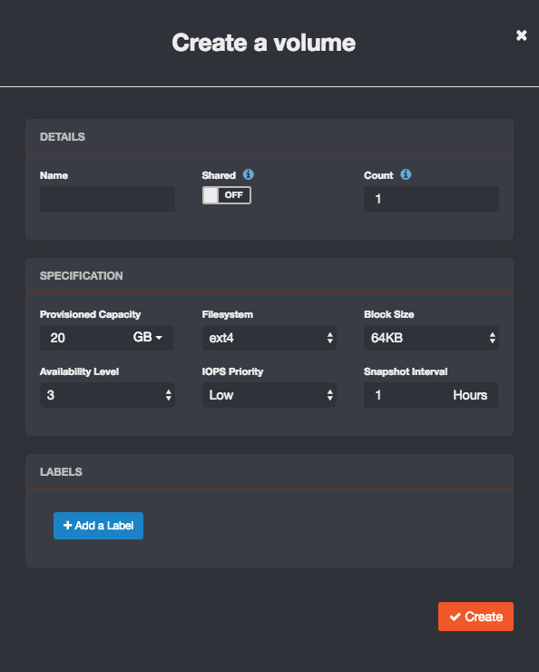

To create volumes from the PX-Enterprise console, click **Storage** and then click **+**New next to **VOLUMES**.

In the **Configure Your Volume** page, specify these settings and then click **Create** to create a volume.

|Setting|Description|
|---|---|
|Shared|Indicates whether this volume can be shared concurrently with multiple containers and/or accessed externally via NFS. Defaults to **OFF**.|
|Provisioned Capacity|The volume size: GB (default) or TB.|
|Filesystem|The file system type:  **ext4** (default), **xfs**, or **None**.|
|Block Size|The file system block size: **4K**, **8K**, **32K**, **64K**(default)|
|Availability Level|The number of nodes used to replicate volume data for availability.|
|IOPS Priority|The class of service for performance, using the various available tiers.|
|Snapshot Interval|The number of hours between automatic snapshots taken for crash-consistent volume recovery.|
|Volume Labels|Specific labels or name/value pairs for coordination with orchestration engines.|
|Count|The number of volumes to create simultaneously.|

## Manage Storage Volumes

To manage an existing volume, go to the **Storage** page and select the volume.

* In the **Details** area, view all attributes as well as any referencing containers and nodes used for replication, as shown in the following sample.

* In the **Actions** area, you can clone (or snapshot), edit or delete a volume.

![Manage a storage volume](images/storage-details-updated.png "Manage a storage volume"

* **Edit Volume** lets you change availibility level and snapshot interval of an existing volume.

![Edit a storage volume](images/edit-volume.png "Edit a storage volume"
