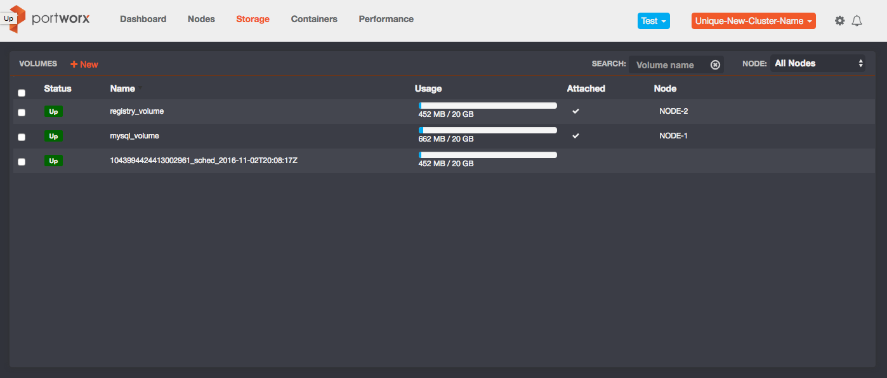
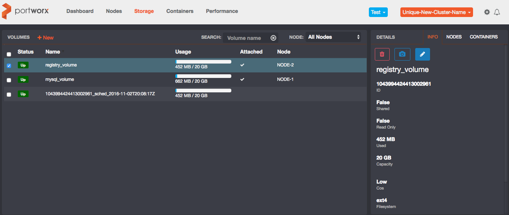
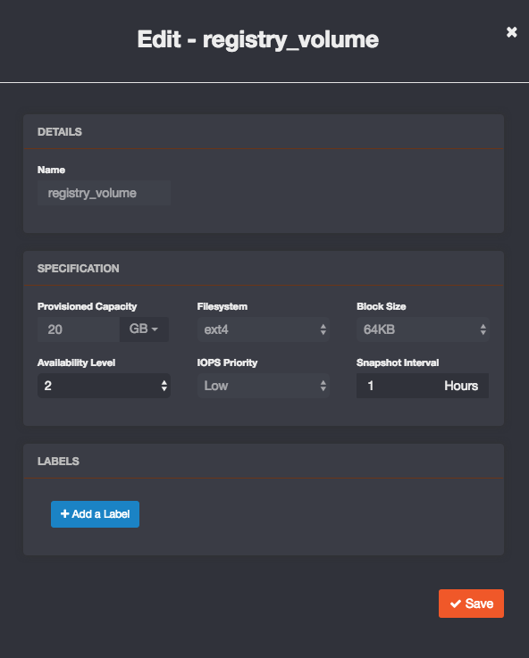

To create and manage volumes, use `pxctl volume`. You can use the created volumes directly with Docker with the `-v` option.

```
NAME:
   pxctl volume - Manage volumes

USAGE:
   pxctl volume command [command options] [arguments...]

COMMANDS:
     create, c             Create a volume
     list, l               List volumes in the cluster
     update                Update volume settings
     ha-update, u          Update volume HA level
     snap-interval-update  Update volume configuration
     inspect, i            Inspect a volume
     requests              Show all pending requests
     delete, d             Delete a volume
     stats, st             Volume Statistics
     alerts, a             Show volume related alerts
     import                Import data into a volume

OPTIONS:
   --help, -h  show help
```

## `volume create` and Options

Storage is durable, elastic, and has fine-grained controls. Portworx creates volumes from the global capacity of a cluster. You can expand capacity and throughput by adding a node to the cluster. Portworx protects storage volumes from hardware and node failures through automatic replication.

* Durability: Set replication through policy, using the High Availability setting.
 * Each write is synchronously replicated to a quorum set of nodes.
 * Any hardware failure means that the replicated volume has the latest acknowledged writes.
* Elastic: Add capacity and throughput at each layer, at any time.
 * Volumes are thinly provisioned, only using capacity as needed by the container.
  * You can expand and contract the volume's maximum size, even after data has been written to the volume.

A volume can be created before use by its container or by the container directly at runtime. Creating a volume returns the volume's ID. This same volume ID is returned in Docker commands (such as `Docker volume ls`) as is shown in `pxctl` commands.

>**Note:**<br/>Portworx recommends generally creating volumes "in-band" through `docker volume create`. Employing mixed modes for volume management, including creation, is not generally recommended.

Example of creating a volume through `pxctl`, where the volume ID is returned:

```
 # pxctl volume create foobar
 3903386035533561360
```

Throughput is controlled per container and can be shared. Volumes have fine-grained control, set through policy.

 * Throughput is set by the Class of Service setting. Throughput capacity is pooled.
  * Adding a node to the cluster expands the available throughput for reads and writes.
  * The best node is selected to service reads, whether that read is from a local storage devices or another node's storage devices.
  * Read throughput is aggregated, where multiple nodes can service one read request in parallel streams.
* Fine-grained controls: Policies are specified per volume and give full control to storage.
 * Policies enforce how the volume is replicated across the cluster, IOPs priority, filesystem, blocksize, and additional parameters described below.
 * Policies are specified at create time and can be applied to existing volumes.

Set policies on a volume through the options parameter. Or, set policies through a Docker Compose file. Using a Kubernetes Pod spec is slated for a future release.

Show the available options through the --help command, as shown below:

```
# pxctl volume create --help
NAME:
   pxctl volume create - Create a volume

USAGE:
   pxctl volume create [command options] [arguments...]

OPTIONS:
   --shared                           Specify --shared to make this a globally shared namespace volume
   --passphrase value                 passphrase to use for the PBKDF2 function
   --label value, -l value            Comma separated name=value pairs, e.g name=sqlvolume,type=production
   --size value, -s value             specify size in GB (default: 1)
   --fs value                         filesystem to be laid out: none|xfs|ext4 (default: "ext4")
   --seed value                       optional data that the volume should be seeded with
   --block_size value, -b value       block size in Kbytes (default: 32)
   --repl value, -r value             replication factor [1..3] (default: 1)
   --io_priority value                IO Priority: [high|medium|low] (default: "low")
   --snap_interval value, --si value  snapshot interval in minutes, 0 disables snaps (default: 0)
   --daily value, --sd value          daily snapshot at specified hh:mm
   --weekly value, --sw value         weekly snapshot at specified weekday@hh:mm
   --monthly value, --sm value        monthly snapshot at specified day@hh:mm
   --nodes value                      Comma seprated Node Id(s)
```

### Global Namespace (Shared Volumes)

To use Portworx volumes across nodes and multiple containers, see [Shared Volumes](shared-volumes.html).

## Volumes with Docker

All `docker volume` commands are reflected into Portworx storage. For example, a `docker volume create` command provisions a storage volume in a Portworx storage cluster.

```
# docker volume create -d pxd --name <volume_name>
```

As part of the `docker volume` command, you can add optional parameters through the `--opt` flag. The option parameters are the same, whether you use Portworx storage through the Docker volume or the `pxctl` commands.

Example of options for selecting the container's filesystem and volume size:

```
  docker volume create -d pxd --name <volume_name> --opt fs=ext4 --opt size=10G
```

## Inline volume spec

PX supports passing the volume spec inline along with the volume name.  This is useful when creating a volume with your scheduler application template inline and you do not want to create volumes before hand.

For example, a PX inline spec can be specified as the following:

```
# docker volume create -d pxd --name cos=3,size=10G,ha=3,name=demovolume
```

Each spec key must be comma seperated.  The following are supported key value pairs:

```
IO priority      - cos=[1,2,3]
Volume size      - size=[1..9][G|M|T]
HA factor        - ha=[1,2,3]
Block size       - bs=[4096...]
Shared volume    - shared=true
File System      - fs=[xfs|ext4]
Encryption       - passphrase=secret
```

These inline specs can be passed in through the scheduler application template.  For example, below is a snippet from a marathon configuration file:

```json
"parameters": [
	{
		"key": "volume-driver",
		"value": "pxd"
	},
	{
		"key": "volume",
		"value": "size=100G,ha=3,cos=3,name=mysql_vol:/var/lib/mysql"
	}],
```

## Volumes with the PX Enterprise console

To create volumes from the PX Enterprise console, click **Storage** and then click **+**New next to **VOLUMES**.



In the **Configure Your Volume** page, specify these settings and then click **Create** to create a volume.

|Setting|Description|
|---|---|
|Shared|Indicates whether this volume can be shared concurrently with multiple containers and/or accessed externally via NFS. Defaults to **OFF**.|
|Provisioned Capacity|The volume size: GB (default) or TB.|
|Filesystem|The file system type:  **ext4** (default), **xfs**, or **None**.|
|Block Size|The file system block size: **4K**, **8K**, **32K**, **64K**(default)|
|Availability Level|The number of nodes used to replicate volume data for availability.|
|IOPS Priority|The class of service for performance, using the various available tiers.|
|Snapshot Interval|The number of hours between automatic snapshots taken for crash-consistent volume recovery.|
|Volume Labels|Specific labels or name/value pairs for coordination with orchestration engines.|
|Count|The number of volumes to create simultaneously.|


To manage an existing volume, go to the **Storage** page and select the volume.

* In the **Details** area, view all attributes as well as any referencing containers and nodes used for replication, as shown in the following sample.

* In the **Actions** area, you can clone (or snapshot), edit or delete a volume.



* **Edit Volume** lets you change availibility level and snapshot interval of an existing volume.


