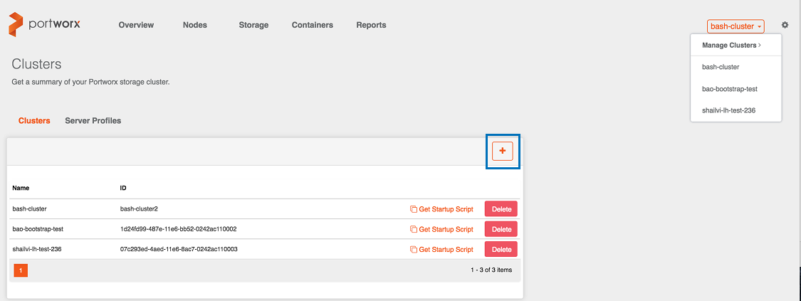
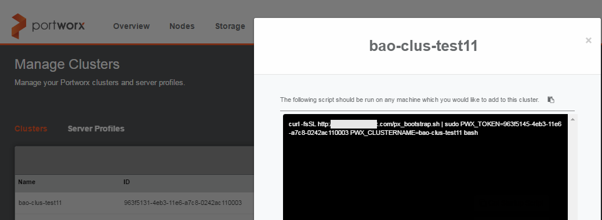
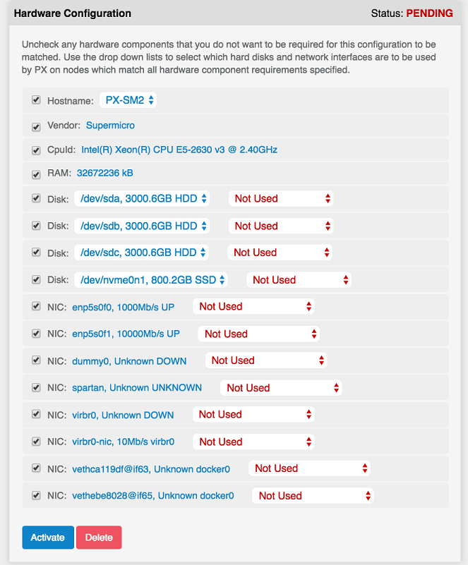
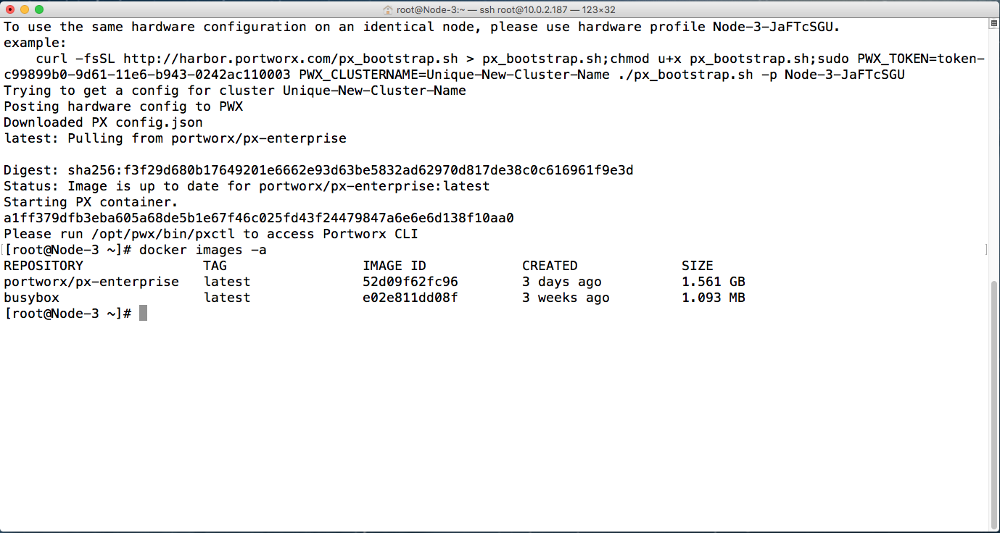

PX-Enterprise is a multi-cluster storage system that provides and manages storage for containerized workloads which run on-premises and in public clouds.

This section walks through installing and configuring a PX-Enterprise cluster. In this example, you run the PX-Enterprise Docker container on server nodes. Running the container enables PX-Enterprise to aggregate storage capacity and monitor hardware for degradation and failure. Server nodes are joined into a cluster for the sake of high availability. You can use direct attached disks, storage arrays, or cloud volumes for the underlying storage.

## Step 1: Provision a cluster in the PX-Enterprise console

Log in to the PX-Enterprise console. If a cluster has not already been created for your account, click the **Manage Clusters** menu and then click **Manage Clusters**.

On the **Clusters** page, click the **+** icon to create a new storage cluster.

Then, type a unique Name for your PX-Enterprise cluster and click **Create**.

(The "Existing Cluster" option should not be used, unless so directed by Portworx Support)

## Step 2: Run discovery on a server node

You will now add your first server node to the storage cluster. Click **Get Startup Script** for the cluster you just created. The window below appears with a `curl` command. This `curl` example includes an authentication token and downloads the PX-Enterprise Docker container.

Log in to the first server node that will install PX-Enterprise and join the cluster. Open a terminal window and run as `root` or `sudo su` to give privileges. Copy the above curl string and paste it into a terminal session and press Enter, as shown below.

## Step 3: Select storage to be aggregated

The bootstrap startup script sends its configuration to the PX-Enterprise console. To view the discovered hardware configuration, click **Server Profiles**. If the hardware configuration is new, you can specify what storage you want aggregated by PX-Enterprise.

The following example of the Hardware Configuration page shows the discovered attributes, including hostname, server vendor, CPU, RAM, storage devices, and network devices. The Hardware Configuration rule performs the following:

* **Storage**: Aggregates storage based on the disks you select by toggling the drop-down list from **Not Used** to **Used**.

* **Network**: Specifies the interfaces PX-Enterprise should use for management and the data path. Set by toggling the drop-down list from **Not Used** to **Allocate to PX**.

* **Criteria**: Performs the above tasks based on the check boxes you select.

Only servers matching all criteria will install PX-Enterprise. In the example above, only servers with the same Vendor, CPU ID, selected disks, and selected NICs will join the cluster.

>**Important:** As part of aggregation, PX-Enterprise overwrites any pre-existing data on the underlying storage. Preserve any data that you want to keep.  

### General vs. specific Server Profiles

For storage disks, you can match based on wildcards. For example:

* Storage of any size and any type (SSD, HDD, or other): 
`/dev/sdc *  *`

* Storage must have a specified size: 
`/dev/sdc 300GB *`

* Storage must have a specified type: 
`/dev/sdc 300GB SSD`

Consider carefully the implications of making a Server Profile more general or more specific. For a new server node to be automatically accepted into the PX-Enterprise cluster, the server must match an activated Server Profile.

* When a Server Profile is more general (the Hardware Configuration page has fewer check boxes selected), new nodes can more easily join a cluster because they are activated without your intervention.

* When a Server Profiles is more specific, such as matched on hostnames, you must specifically activate those Server Profiles before servers can join a cluster.

PX-Enterprise aggregates and monitors for health only the disks marked with **Allocated to PX**.

## Step 4: Select network interfaces and activate

Portworx assigns the selected NICs to the management interface, the data interface, or both. Portworx only needs a maximum of two NICs.

The *management interface* is used for communication between the hosted PX-Enterprise product and the individual server nodes, for control-path as well as statistics and metrics. The *data interface* is used between server nodes, primarily for data transfer as part of data availability (that is, multi-node data replication).

To instruct the PX-Enterprise container on the server node to complete the installation, click **Activate**. Upon installation, PX-Enterprise aggregates the specified storage and uses the network interfaces selected.

From the server node that ran the `curl` command, you should see the following status:

## Step 5: Expand the cluster

You can add new servers nodes to the existing cluster by running the bootstrap script for a cluster. Server nodes can have different Server Profiles, where some servers might contribute little or no storage to the cluster.

>**Important:** For server node connections, use a low-latency network, as opposed to spanning a WAN. For more details, see [Step 1: Verify requirements](get-started-px-developer.html#step-1-verify-requirements).

For a new server node to be automatically accepted into the PX-Enterprise cluster, the server must match an activated Server Profile.
