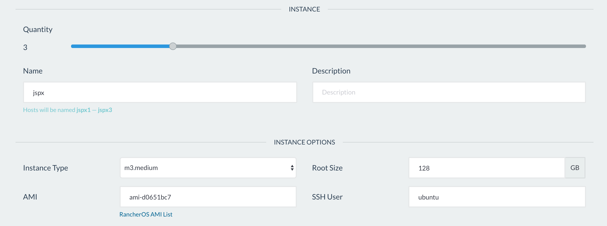

You can deploy Portworx through Rancher using the Rancher's Portworx Catalog.
The following sequence illustrates deployment in an Amazon AWS/EC2 environment.

### Step 1: Add a Host
For availability zone, use either "West N. California", or "East N. Virginia".  If you need a different availability zone, please contact support@portworx.com.

### Step 2: Configure Instance

* Select the name and count of your instances
* Use **m3.medium** as the instance type
* For US-West (N. California), use **ami-ebe6a98b** as the AMI image name
* For US-East (N. Virginia), use **ami-d0651bc7** as the AMI image name.
* Specify **128GB** as the root size

### Step 3 : Advanced Options

* Expand "Advanced Options".  For "Docker Install URL", select "Latest" from the dropdown

### Step 4:  Add Portworx Service

Next, select "Add From Catalog".  Select Portworx.
For "Cluster Token", provide the token supplied to you from Portworx.
Select Launch
