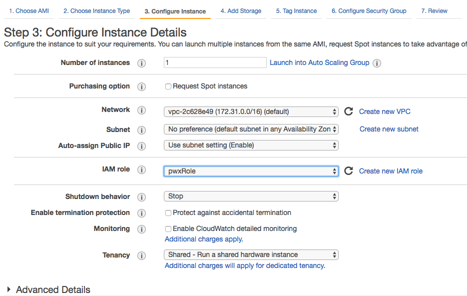
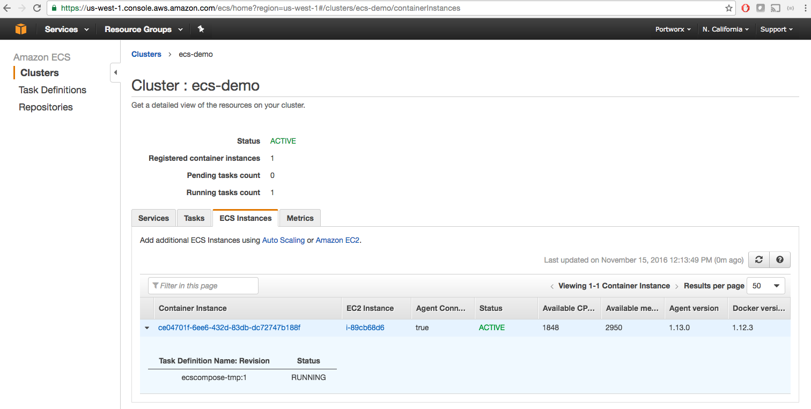

This reference guide shows how to configure and run Portworx with User Namespaces under a Flannel SDN.

### Introduction
This guide has been qualified under CentOS 7.

Using Portworx within the context of the Flannel overlay network requires two different independent KVDB’s:
* For the Flannel Overlay network
* For Portworx 

The [Flannel SDN](https://coreos.com/flannel/docs/latest) is dependent on 'etcd'.   
And since Portworx will be running within a Flannel SDN context, it must therefore have its own instance of 'etcd'.
For this guide, the Flannel 'etcd' will run in a host context and the Portworx 'etcd' will run in a container context.

This guide further assumes the following:
* The Docker Engine runs with User Namespaces enabled
* The Portworx 'etcd' instance runs with *--net=bridge*
* The Portworx instance runs with *--privileged=true* and *--net=host*

### Deploy 'etcd' at the host level
For every node participating a member of the host-level 'etcd' cluster,
install, configure, and deploy ‘etcd’ as follows:

```
yum -y install etcd
```

Configure /etc/etcd/etcd.conf as follows, using IPaddrs appropriate for your environment:

```
ETCD_NAME=default
ETCD_DATA_DIR="/var/lib/etcd/default.etcd"
ETCD_LISTEN_PEER_URLS="http://10.1.2.3:2380"
ETCD_LISTEN_CLIENT_URLS="http://10.1.2.3:2379"
ETCD_INITIAL_ADVERTISE_PEER_URLS="http://10.1.2.3:2380"
ETCD_INITIAL_CLUSTER="default=http://10.1.2.3:2380"
ETCD_INITIAL_CLUSTER_STATE="new"
ETCD_INITIAL_CLUSTER_TOKEN="etcd-cluster"
systemctl enable etcd
systemctl restart etcd
systemctl status etcd
```

Install ‘etcdctl’

```
wget https://github.com/coreos/etcd/releases/download/v3.0.15/etcd-v3.0.15-linux-amd64.tar.gz
tar xzvf
mv etcdctl /usr/local/bin;  chmod +x /usr/local/bin/etcdctl
export ETCDCTL_ENDPOINT=http://10.1.2.3:2379
```


Using your appropriate IP:port


Do Once:
etcdctl set /flannelsdn/network/config '{ "Network": "10.1.0.0/16" }'


Using your appropriate values for the root directory (i.e. “flannelsdn”) and the Network Subnet

Install, Configure, Deploy “flanneld”
On ALL hosts (using appropriate kernel version)
sudo grubby --args="user_namespace.enable=1"   \
                     --update-kernel=/boot/vmlinuz-`uname -r`   && reboot
Validate with : cat /proc/cmdline.   Should yield:
BOOT_IMAGE=/vmlinuz-3.10.0-327.36.2.el7.x86_64 root=/dev/mapper/centos-root ro crashkernel=auto rd.lvm.lv=centos/root rd.lvm.lv=centos/swap rhgb quiet LANG=en_US.UTF-8 user_namespace.enable=1


Start flannel with the following form, either manually or through systemd:
flanneld -etcd-endpoints=http://10.0.6.234:2379 -etcd-prefix=/flannelsdn/network -iface=enp0s3
Using your appropriate values 


Configure User Namespaces
# Create a user called "dockremap"
$ sudo adduser dockremap

# Setup subuid and subgid
$ sudo sh -c 'echo dockremap:500000:65536 > /etc/subuid'
$ sudo sh -c 'echo dockremap:500000:65536 > /etc/subgid'


Validate User Namespaces are in place


# docker run -it --rm --privileged=true busybox sh
docker: Error response from daemon: Privileged mode is incompatible with user namespaces.


Configure docker to use the overlay network
For all hosts running docker, do the following :
Reveal the overlay network via  :   “cat /run/flannel/subnet.env”  on each host.   Ex:
FLANNEL_NETWORK=10.1.0.0/16
FLANNEL_SUBNET=10.1.42.1/24
FLANNEL_MTU=1472
FLANNEL_IPMASQ=false


Use the respective FLANNEL_SUBNET and FLANNEL_MTU values to configure “docker” on each host.    For example:
Configure the “docker.service” file as follows:
/usr/bin/dockerd --bip="10.1.42.1/24" --mtu=1472 --userns-remap=default


systemctl daemon-reload
systemctl restart docker


Verify overlay network functionality on each host
On separate hosts:  “docker run -itd busybox”
                                 “docker exec -it <ID>  ifconfig eth0”   (for both hosts)
                                 “docker exec it <ID> ping <otherbox IP>”


Start up ‘etcd’ in bridged mode for Portworx
Use the following format for launching a local containerized etcd for Portworx.   
To make use of the overlay network, note that ‘etcd’ runs with “--net=bridge”.   Also note the exposed ports are changed from 2379 and 2380 to 12379 and 12380 respectively, so as not to conflict with the ‘etcd’ ports being used by the host-level ‘etcd’.


IPADDR=10.0.6.234
docker run -d -p 14001:14001 -p 12379:12379 -p 12380:12380                     \
     --net=bridge							     \
     --restart=always                                                         \
     --name etcd-px quay.io/coreos/etcd:v2.3.7                                \
     -name etcd0                                                              \
     -data-dir /var/lib/etcd/                                                 \
     -advertise-client-urls http://${IPADDR}:12379,http://${IPADDR}:14001       \
     -listen-client-urls http://0.0.0.0:12379                                  \
     -initial-advertise-peer-urls http://${IPADDR}:12380                       \
     -listen-peer-urls http://0.0.0.0:12380                                    \
     -initial-cluster-token etcd-cluster                                      \
     -initial-cluster etcd0=http://${IPADDR}:12380                             \
     -initial-cluster-state new


Start up Portworx


docker run --restart=always --name px -d --net=host \
                 --privileged=true                             \
                 --userns=host                                 \
                 -v /run/docker/plugins:/run/docker/plugins    \
                 -v /var/lib/osd:/var/lib/osd:shared           \
                 -v /dev:/dev                                  \
                 -v /etc/pwx:/etc/pwx                          \
                 -v /opt/pwx/bin:/export_bin:shared            \
                 -v /var/run/docker.sock:/var/run/docker.sock  \
                 -v /var/cores:/var/cores                      \
                 -v /lib/modules:/lib/modules                  \
                 --ipc=host                                    \
                portworx/px-enterprise -daemon -k etcd://10.0.6.234:12379 -c mypxcluster -a -f 


Note:   The etcd IP:Port of the containerized ‘etcd’, not the host etcd.
Note:   (--userns=host?  Required or optional??? )


Reference Links:
                          
http://chunqi.li/2015/10/10/Flannel-for-Docker-Overlay-Network/


http://www.slideshare.net/lorispack/using-coreos-flannel-for-docker-networking


http://cloudgeekz.com/1016/configure-flannel-docker-power.html


https://coderwall.com/p/s_ydlq/using-user-namespaces-on-docker


### Step 1: Create an ECS cluster
In this example, we create an ECS cluster called `ecs-demo` using EC2 instances in the US-WEST-1 region.

We strongly recommend using a Linux AMI with a newer distro compared to the default ECS AMI.  The default ECS AMI uses an older distro and Docker 1.11.

In this example, we created an EC2 instance using the Ubuntu Xenial 16.04 AMI.

Note that Portworx recommends a minimum cluster size of 3 nodes.

#### Create the cluster in the console
Log into the ECS console and create an ecs cluster called "ecs-demo".

.

We will use the name `ecs-demo` to configure your EC2 instances and the `ecs-cli`.

#### Create your EC2 instances
Your EC2 instances must have the correct IAM role set.  Follow these [IAM instructions](http://docs.aws.amazon.com/AmazonECS/latest/developerguide/instance_IAM_role.html).



#### Add storage capacity to each instance
You will need to provision storage to these instances by creating new EBS volumes and attaching it to the instances.  Portworx will be using these volumes to provision storage to your containers.

#### Turn each EC2 instance into an ECS instance
Follow [these](http://docs.aws.amazon.com/AmazonECS/latest/developerguide/ecs-agent-install.html) instructions to install the `ecs-agent` on each EC2 instance to convert it into an ECS instance.

Your command to launch the ecs-agent will look like this:

```
# sudo docker run --name ecs-agent \
		--detach=true \
		--restart=on-failure:10 \
		--volume=/var/run/docker.sock:/var/run/docker.sock \
		--volume=/var/log/ecs/:/log \
		--volume=/var/lib/ecs/data:/data \
		--net=host \
		--env=ECS_LOGFILE=/log/ecs-agent.log \
		--env=ECS_LOGLEVEL=info \
		--env=ECS_DATADIR=/data \
		--env=ECS_CLUSTER=ecs-demo \
		--env=ECS_ENABLE_TASK_IAM_ROLE=true \
		--env=ECS_ENABLE_TASK_IAM_ROLE_NETWORK_HOST=true \
		amazon/amazon-ecs-agent:latest
```

Note the use of the cluster name `ecs-demo` in the `--env=ECS_CLUSTER` environment variable.  Once this has been done, these nodes will now become part of your ECS cluster named `ecs-demo`

### Step 2: Deploy Portworx
Run Portworx on each ECS instance.  Portworx will use the EBS volumes you provisioned in step 4.  You will have to log into each of the ECS instances for this step.

```
# ssh -i ~/.ssh/id_rsa ec2-user@35.163.77.134
# sudo docker run --restart=always --name px -d --net=host \
                 --privileged=true                             \
                 -v /run/docker/plugins:/run/docker/plugins    \
                 -v /var/lib/osd:/var/lib/osd:shared           \
                 -v /dev:/dev                                  \
                 -v /etc/pwx:/etc/pwx                          \
                 -v /opt/pwx/bin:/export_bin:shared            \
                 -v /var/run/docker.sock:/var/run/docker.sock  \
                 -v /var/cores:/var/cores                      \
                 -v /usr/src:/usr/src                          \
                 --ipc=host                                    \
                portworx/px-dev -daemon -k etcd://myetc.company.com:4001 -c MY_CLUSTER_ID -a -z -f
```

### Step 3: Install the ECS CLI
Download and install the ECS CLI utilities on your workstation.  We will be creating an ECS cluster using the Amazon ECS CLI from your workstation.

1. Download and install the ECS CLI by following [these instructions](http://docs.aws.amazon.com/AmazonECS/latest/developerguide/ECS_CLI_installation.html)
2. Obtain your AWS access key ID and secret access key.  Export these environment variables.

```
# export AWS_ACCESS_KEY_ID=XXXXXXXXXXXXXXX
# export AWS_SECRET_ACCESS_KEY=XXXXXXXXXXXXXX
```

Now configure the ecs-cli
```
# ecs-cli configure --region us-west-1 --access-key $AWS_ACCESS_KEY_ID --secret-key $AWS_SECRET_ACCESS_KEY --cluster ecs-demo
```

Note the parameter `--cluster ecs-demo`.  This is what configures your CLI to talk to the ecs cluster named `ecs-demo`.

### Step 4: Test it
Create PX volumes using the Docker CLI.  Log into any of the ECS instances and create the PX volumes.

```
# ssh -i ~/.ssh/id_rsa ec2-user@35.163.77.134
# docker volume create -d pxd --name=demovol
demovol

# docker volume ls
DRIVER              VOLUME NAME
pxd                 demovol
```
Note: You can also do this from your workstation by exporting the `DOCKER_HOST` variable to point to any of the ECS instances.  Docker will have to be configured to listen on a TCP port.

Now you can use the `ecs-cli` to create tasks and use the PX volumes.  Launch `redis` with the PX volume from your workstation.

```
# cat redis.yml
web:
  image: binocarlos/moby-counter
  links:
    - redis:redis
redis:
  image: redis
  volumes:
     - demovol:/data
# ecs-cli compose --file redis.yml up 
```

You can view the task in the ECS console.


