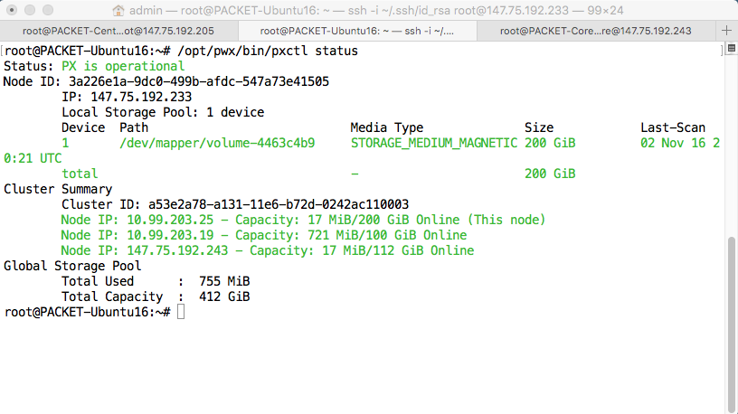
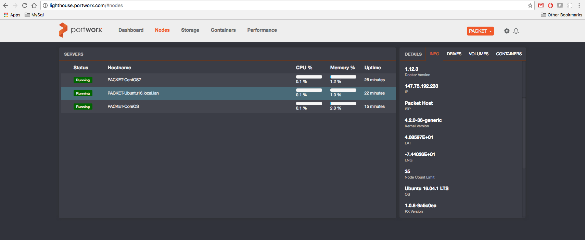

This guide shows you how you can easily deploy Portworx on the [**AWS CloudFormation**](https://aws.amazon.com/cloudformation/)

### Step 1: Load PX CloudFormation Template 

The [Porworx CloudFormation](/px_aws_coreos_cf.json) Template is based on the CoreOS Autoscaling cluster.
The defaults are:

+ cluster size = 3
+ cluster type = m3.medium
+ single disk = 128GB

This template is based on the CoreOS "Stable" Channel and includes the following to enable Portworx deployments:

+ An additional non-root device called "/dev/xvdb" for the global shared storage pool
+ Opened ports for 'etcd', 'ssh', and 'portworx' management services (2379, 2380, 4001, 9001, 9002)

Defaults can be changed by modifying the CloudFormation json file.

Portworx recommends a minimum cluster size of 3 nodes.

Load the template, select the number of nodes, type of instance and keys, as seen here:

### Step 2: Launch PX-Enterprise
[Follow the instructions to launch PX-Enterprise](get-started-px-enterprise.html)

Use the docker run command to launch PX-Enterprise, substituting the appropriate multipath devices and network interfaces, as identified from the previous steps.

Alternatively, you can either run the 'px_bootstrap' script from curl, or construct your own [config.json](config-json.html) file.

From the server node running px-enterprise container, you should see the following status:

You should also be able to monitor cluster from PX-Enterprise console:

