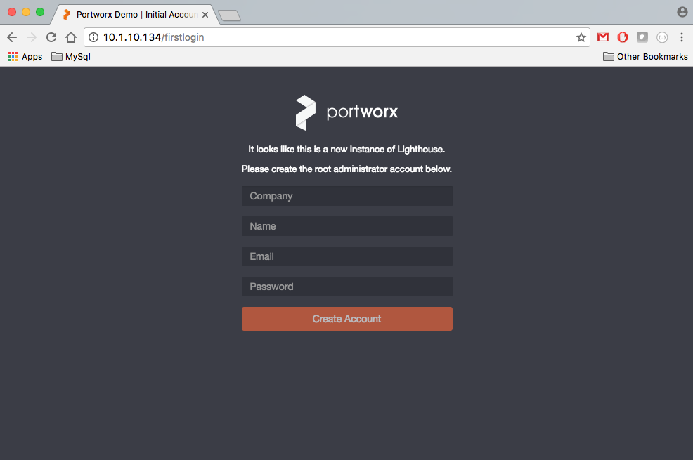

This guide shows you how you can run [PX-Enterprise Console](http://lighthouse.portworx.com/) locally.

Note: The example in this section uses Amazon Web Services (AWS) Elastic Compute Cloud (EC2) for servers in the cluster. In your deployment, you can use physical servers, another public cloud, or virtual machines.

### Prerequisite

To start, create one server, following these requirements:

* Image: Must support Docker 1.10 or later, such as:
  * [Red Hat 7.2 (HVM)](https://aws.amazon.com/marketplace/pp/B019NS7T5I) or CentOS
  * [Ubuntu 16.04 (HVM)](https://aws.amazon.com/marketplace/pp/B01JBL2M0O)
  * [Ubuntu 14.04 (HVM)](https://aws.amazon.com/marketplace/pp/B00JV9TBA6)
* Instance type: c3.xlarge
* Number of instances: 1
* Storage:
  * /dev/xvda: 8 GB boot device
* Tag (optional): Add value **px-lighthouse** as the name

### Install and configure Docker

1. Follow the Docker [install guide] (https://docs.docker.com/engine/installation/) to install and start the Docker Service.
2. Verify that your Docker version is 1.10 or later.

### Step 1: Install kvdb


```
For PX-Lighthouse, output required from this step: 
1) connection String in etcd:http://<IP_Address>:<Port_NO> format
```

* Use your existing kvdb store
* Install as a docker container from the following 
  * [etcd2/etcd3](https://github.com/coreos/etcd/blob/2724c3946eb2f3def5ed38a127be982b62c81779/Documentation/op-guide/container.md)
  * [consul](https://hub.docker.com/_/consul/)

### Step 2: Install InfluxDB

```
For PX-Lighthouse, output required from this step: 
1) ADMIN_USER, 
2) INFLUXDB_INIT_PWD and 
3) INFLUXDB_HOSTNAME in http://<name>:<port> format
```

* [Use InfluxCloud](https://cloud.influxdata.com/)
* [Run InfluxDB as a docker container](https://github.com/tutumcloud/influxdb)

### Step 3: Launch the PX-Lighthouse Container

### Docker compose method


Use compose file provided at this [link](https://github.com/portworx/lighthouse/tree/master/on-prem).


### To run the PX-Lighthouse container


```
# sudo docker run --restart=always --name px-lighthouse -d --net=bridge \
                 -p 80:80                                               \
                 -e  PWX_INFLUXDB="http://<name>:<port>"                \
                 -e PWX_INFLUXUSR="$ADMIN_USER"                         \
                 -e PWX_INFLUXPW="$INFLUXDB_INIT_PWD"                   \
                 -e PWX_HOSTNAME="${LOCAL_IP}"                          \
                 portworx/px-lighthouse                                 \
                 etcd:http://<IP_Address>:<Port_NO>
```


In your browser visit *http://IP_ADDRESS:80* to access your locally running PX-Lighthouse.


