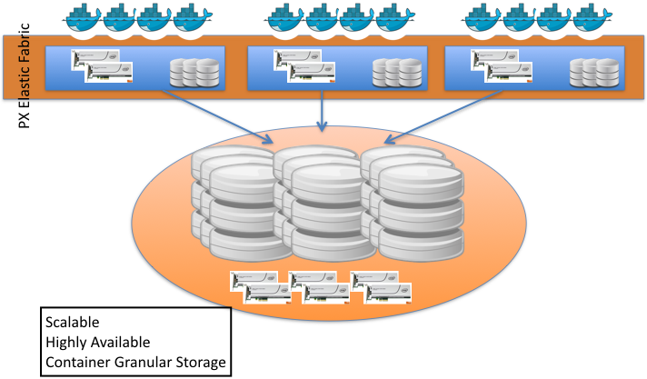

Through shared volumes (also known as a `global namespace`), a single volume's filesystem is concurrently available to multiple containers running on multiple hosts.



A typical pattern is for a single container to have one or more volumes. Conversely, many scenarios would benefit from multiple containers being able to access the same volume, possibly from different hosts. Accordingly, the shared volume feature enables a single volume to be read/write accessible by multiple containers. Example use cases include:

* A technical computing workload sourcing its input and writing its output to a shared volume.
* Scaling a number of Wordpress containers based on load while managing a single shared volume.

## Create shared volumes
To create a Portworx shared volume, use the **pxctl** command.  (Future releases will enable shared volumes through `docker volume create`.)

```
# pxctl volume create my_shared_vol --shared --size=5 --repl=3
# pxctl volume list
ID			            NAME		        SIZE	   HA	  SHARED	STATUS
944424689751331159	    my_shared_vol	    5.0 GiB	   3	  yes	    up - detached
```

Note the "SHARED" status of the volume, in the above output.

## Use shared volumes
Shared volumes are accessed in the same way any  volume would be used in Docker. For example:

```
host1# docker run -it --name box1  -v my_shared_vol:/data --volume-driver=pxd  busybox sh
```

### Use shared volumes from different hosts
A shared volume can be accessed by containers on different hosts. Any host in the cluster can access a shared volume by name. For example:

```
host2# docker run -it --name box1  -v my_shared_vol:/data --volume-driver=pxd  busybox sh
```

All writes and modifications to files and directories will be immediately available to consumers of the shared volume. Concurrency of files is handled by the volume's filesystem.

### Use shared volumes externally
Any nodes outside of the Portworx cluster can access a shared volume through NFS with the following format:
```
mount -o nolock HOSTNAME:/var/lib/osd/pxns/my_shared_vol  /local_mnt
```

The "-o nolock" is a temporary restriction, as is the requirement HOSTNAME must correspond to the host where the volume is attached.
